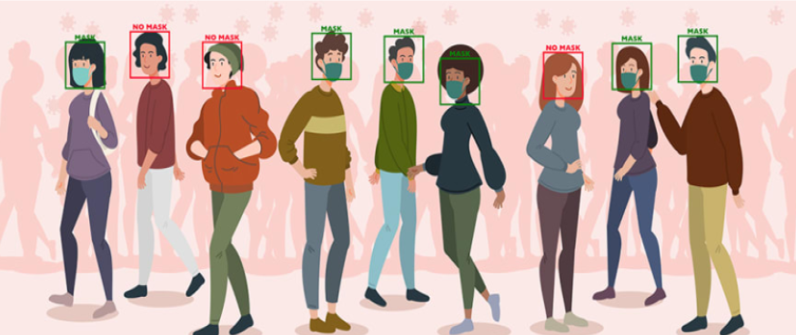

# Face-Mask-Detection

# Requirements :- 
There are some general library requirements for the project and some which are specific to
individual methods. The general requirements are as follows.
● Numpy, Pandas

● scikit-learn

● os

● pil

● Pickle

● cv2

# STRUCTURE OF CODE

# Data Preprocessing

● Importing Libraries

● Mounting Google drive

# Feature Extraction

● Converting image data into array data

● Convert array to numpy

● Plot some dataset images

● Save dataset as pickles

● Load pickles

● Total Classification counts

● Split train and test

# Using KNN

● Make some imports

● Prepare dataset

● Dataset classification distribution

● Convert numpy to dataframe

● Datas shape

● Normalize the data

● Split dataset into train and test

● Apply KNN model

● Performance metrics

● Accuracy Scores

# SVM

● Import Packages

● Load dataset

● Train test split

● Model Building

● Model Evaluation

# CNN
● Import Packages

● Load dataset processed from drive directory

● Convolution layers and Neural networks

● Compile and train the model

● Evaluate performance

● Confusion matrix

# PROCESS OF EXECUTION

One has to simply open the colab file and keep on running all the codes.First upload the
dataset into drive into 2 folders masked and unmasked.Give path to the folder in the
DARADIR.Give other paths as well wherever required.The classifiers will be trained and
tested on test data.Finally user would be able to see the accuracy scores and confusion
matrix of each classifier and would be able to compare the classifiers.

